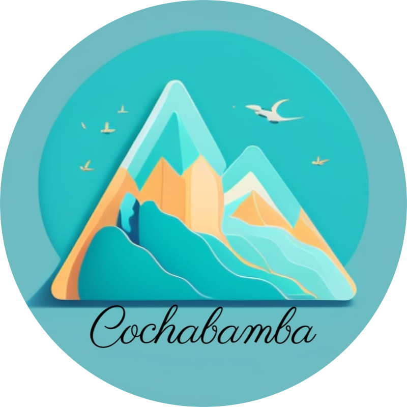
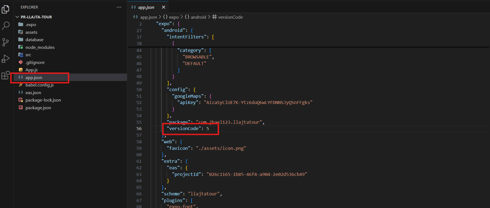
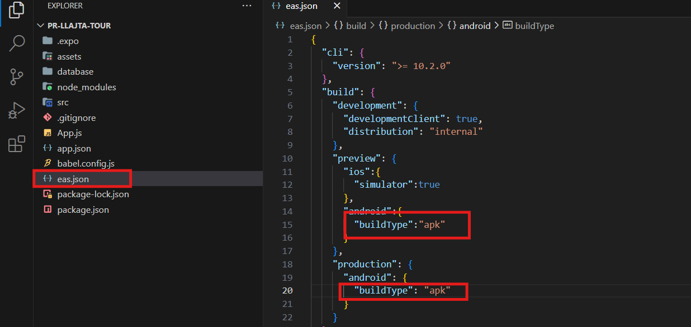
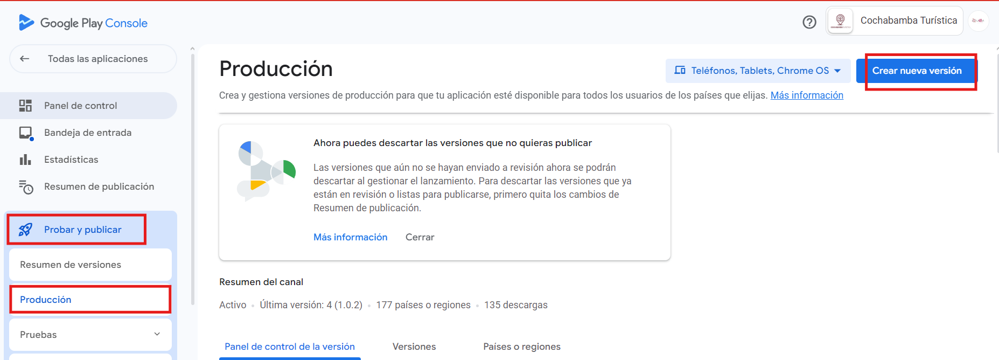
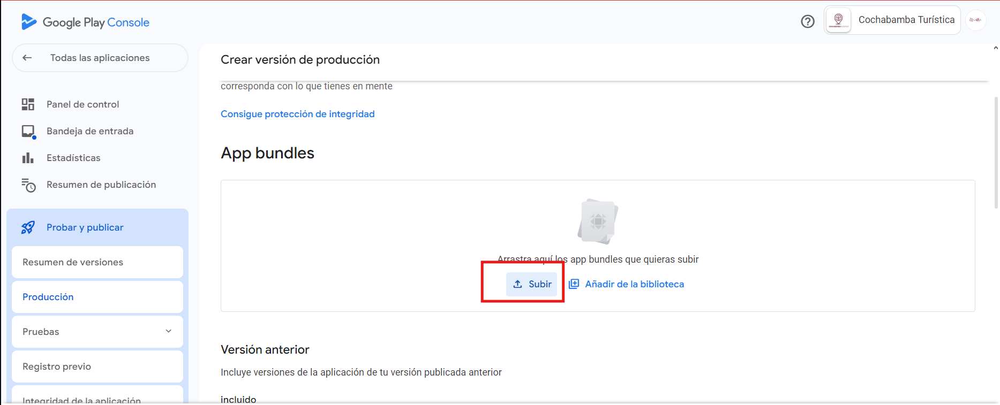
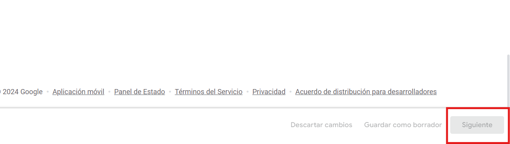
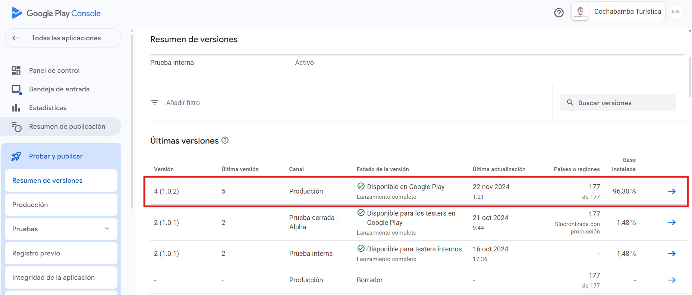
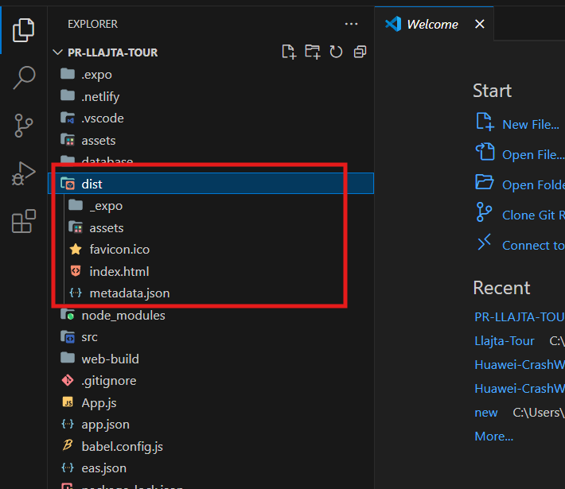

# Cochabamba Turistica-Movil

## Video de Presentación de la App Movil

Haga click en la miniatura.

## Tabla de Contenidos

1. [Introducción](#introducción)
2. [Descripción del Proyecto](#descripción-del-proyecto)
3. [Roles / Integrantes](#roles-e-integrantes)
4. [Arquitectura del Software](#arquitectura-del-software)
5. [Procedimiento para Actualización de la Aplicación en la Play Store](#procedimiento-para-la-actualización-de-la-aplicación-en-la-play-store)
6. [Procedimiento para Actualización de la Aplicación en la Web](#procedimiento-para-la-actualización-de-la-aplicación-en-la-web)
7. [Manual de la base de datos](#manual-de-la-base-de-datos)
8. [Referencias y Recursos Adicionales](#referencias-y-recursos-adicionales)
9. [Bibliografía](#bibliografía)

## **INTRODUCCIÓN**

La aplicación Cochabamba Turística es una herramienta diseñada para facilitar y enriquecer la experiencia de quienes desean conocer los principales atractivos turísticos de la ciudad de Cochabamba, Bolivia. A través de una interfaz intuitiva y funcionalidades prácticas, los usuarios pueden acceder a información detallada de los lugares turísticos, explorar mapas interactivos, y disfrutar de contenido multimedia como imágenes, videos y audios.

## **DESCRIPCIÓN DEL PROYECTO**

El proyecto Cochabamba Turística presenta una innovadora iniciativa tecnológica orientada a promover y facilitar el turismo en la ciudad de Cochabamba, Bolivia. A través del desarrollo de una aplicación móvil, esta plataforma busca conectar a los usuarios con la riqueza cultural, histórica y natural de la región, ofreciendo una experiencia interactiva y personalizada.

La aplicación integra múltiples funcionalidades, como filtros por categoría, nombre o preferencias personales, un sistema de favoritos, y mapas interactivos que permiten ubicar y navegar hacia los destinos turísticos mediante Google Maps. Además, ofrece contenido multimedia enriquecido para cada lugar, incluyendo imágenes actuales e históricas, videos, audios y descripciones detalladas, permitiendo a los usuarios conocer a profundidad cada sitio.

Con un diseño intuitivo y opciones como el inicio de sesión con Google, Cochabamba Turística busca no solo facilitar el acceso a información turística, sino también preservar y difundir la historia y cultura de la región. Este proyecto se plantea como una herramienta clave para fomentar el turismo local, fortalecer la conexión de los habitantes y visitantes con los atractivos de la ciudad, y contribuir al desarrollo sostenible del sector turístico en Bolivia.

## **ROLES E INTEGRANTES**

1. **Team Líder, DB Architect, Developer:** Jhael kuno Bustos
2. **DB Architect, GIT Master, Developer:** Boris Sejas Mendizabal

## **ARQUITECTURA DEL SOFTWARE**

La aplicación Cochabamba Turística sigue una arquitectura basada en el modelo cliente-servidor. En este modelo, el cliente (la aplicación móvil) interactúa directamente con servicios en la nube proporcionados por Firebase y APIs externas para gestionar datos, multimedia, autenticación y mapas.

 - ### **Tecnologías y Herramientas**
    - **Lenguaje de programación:** JavaScript.
    - **Framework:** React Native, utilizado para desarrollar una aplicación móvil multiplataforma (Android y iOS).
    - **Servicios en la nube:** Firebase.
       - *Firestore:* Base de datos NoSQL utilizada para almacenar información de los lugares turísticos y los datos del usuario.
       - *Firebase Storage:* Almacenamiento de archivos multimedia, como imágenes, videos y audios.
       - *Firebase Authentication:* Gestión de autenticación de usuarios con Google.
    - **APIs externas:** Google Maps API, utilizada para la visualización y navegación hacia los destinos turísticos.

 
 ## **PROCEDIMIENTO PARA LA ACTUALIZACIÓN DE LA APLICACIÓN EN LA PLAY STORE**

  - **Paso 1:** Preparación del Proyecto
    - Antes de actualizar la aplicación en la Play Store, asegúrate de tener todo el código actualizado y funcionando correctamente:
      
          npm start

  - **Paso 2:** Verificar las Configuraciones de Expo
     - Asegúrate de que el archivo app.json esté configurado correctamente:
         - versión de la aplicación (version).
         - número de versión de Android (android.versionCode).
            1. 
            2. 

   - **Paso 3:** Generar el archivo Android App Bundle (AAB) utilizando EAS Build
      - En la sección de producción bajo android, cambiamos "buildType": "apk" por "buildType": "app-bundle". Esto hará que EAS Build genere un Android App 
             Bundle (.aab) en lugar de un archivo APK cuando se ejecute el comando de construcción para producción.
         - 

      - Ejecuta el siguiente comando para iniciar la construcción del App Bundle en producción (ABB)
    
            eas build --platform android --profile production

       - Luego tendras el archivo .abb, para luego subirlo a Google Pla
    
   - **Paso 4:** Subir la nueva version a Google Play
        - Ubícate en el panel lateral y encontrarás la opción "Probar y Publicar". Al hacer clic en ella, se desplegarán las subopciones; selecciona 
           "Producción" y luego haz clic en el botom azul "Nueva Versión".
           - 
        
        - Nos pedirá que subamos el archivo .abb.
           - 

        - Le damos clic en "Siguiente", y luego nos pedirá confirmar antes de publicar la nueva versión. Simplemente hacemos clic en "Confirmar".
           - 
        - Finalmente, nos dirigimos a "Resumen de versiones", donde aparecerá la nueva versión que subimos, pero estará en estado de revisión. Se publicará 
          automáticamente una vez que sea aceptada por Google Play.
           - 

  ## **PROCEDIMIENTO PARA LA ACTUALIZACIÓN DE LA APLICACIÓN EN LA WEB**
  - **Paso 1: ** Asegúrate de que tu proyecto esté configurado correctamente en Firebase.

        firebase init

  - **Paso 2: ** Ejecuta el comando de compilación de React Native para crear una nueva versión optimizada para la web esto generar una carpeta dis.
    
          expo build:web

       - 

   - **Paso 3: ** Una vez que la compilación esté lista, navega hasta el directorio de compilación (dist).
               Utiliza el siguiente comando para desplegar la nueva versión de la aplicación a Firebase Hosting:

          firebase deploy --only hosting

     - **Paso 4: ** Después de desplegar, accede a la URL de tu aplicación web alojada en Firebase Hosting para asegurarte de que todo funcione como se 
                    espera.

  ## **MANUAL DE LA BASE DE DATOS**

  

  Haz clic en la miniatura para acceder al video

  ## **REFERENCIAS Y RECURSOS ADICIONALES**

  - [Expo dev](https://docs.expo.dev)
  - [Firebase](https://firebase.google.com/docs?hl=es-419)
  - [React Native](https://reactnative.dev/docs/environment-setup)

  ## **BIBLIOGRAFÍA**
  

  - [Firebase](https://firebase.google.com/docs?hl=es-419)
  - [React Native](https://reactnative.dev/docs/environment-setup)
  - [stackoverflow](https://stackoverflow.com/)
  - [Chatgpt](https://openai.com/index/chatgpt/)

     

